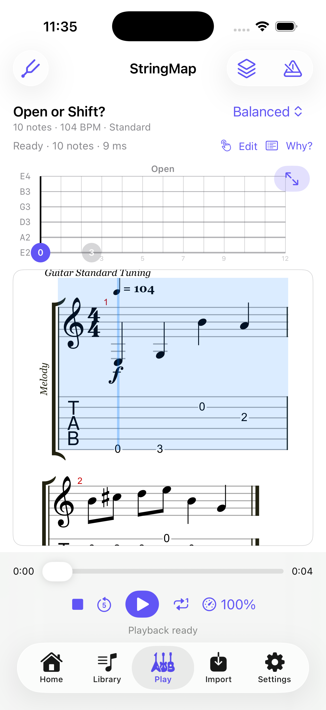

# StringMap

StringMap is a native iPhone/iPad app for turning structured scores into playable, explainable guitar tablature. The shipping implementation includes this complete local structured-score path:

```text
MusicXML → normalized score → all string/fret candidates
         → explainable fingering optimization → alphaTex
         → alphaTab notation, tablature, and synchronized playback
```

The current score contract is deliberately honest: direct MusicXML import supports monophonic melodies. The guitar layer supports Standard, Drop D, Half Step Down, D Standard, DADGAD, and custom six-string tunings; capo, 12–30 fret instruments, transposition, manual locks, and five optimization profiles are real inputs to candidate generation and search.



## Native iOS experience

The SwiftUI app is not a wrapped website. Native tabs provide Home, Library, Play, Import, and Settings. SwiftData stores imported MusicXML, instrument/profile choices, locked positions, arrangement state, and the last practice position locally. The workspace includes:

- standard notation and tablature rendered by the isolated alphaTab view
- synchronized local SoundFont playback and scrub/seek
- a native SwiftUI fretboard following current and upcoming notes
- Beginner, Balanced, Stay in Position, Minimum Movement, and Performance profiles
- measurable Beginner/Balanced/Minimum Movement arrangement comparisons
- tuning, custom tuning, capo suggestion, fret count, and ±24-semitone transposition
- tempo presets, A/B measure looping, count-in, and metronome
- previous/next measure, five-second jump-back, one-tap current-measure loop, loop restart, and tempo reset
- note-by-note alternate position selection and locked-fingering reoptimization
- per-song practice speed, loop, timing options, fingering locks, and resume position
- a complete weighted cost trace plus best-route comparisons for every rejected candidate

Image/PDF recognition is not exposed as a fake conversion. Camera, Photos, PDF OMR, score correction, chords, and polyphony remain gated behind the limitations below.

## Workspace

- `apps/ios` — the native SwiftUI/Xcode application and shipping implementation.
- `apps/ios/Packages/StringMapCore` — independent Swift products for `FingeringEngine` and `ScorePipeline`.
- `packages/fingering-engine` and `packages/score-pipeline` — TypeScript behavioral references.
- `apps/web` — the retained Vite reference application.

The score model sits between ingestion and fingering. A later OMR adapter should produce the same `NormalizedScore`; it does not need to change the optimizer or renderer.

## Run the iOS app

Requires Xcode 26, the iOS 26 simulator runtime, and [XcodeGen](https://github.com/yonaskolb/XcodeGen).

```bash
cd apps/ios/Packages/StringMapCore
swift test

cd ../..
xcodegen generate
open StringMap.xcodeproj
```

The generated project targets iPhone and iPad with bundle ID `com.anishtalla.StringMap`. It launches with a known melody, so notation, tablature, the fingering trace, and playback can be checked immediately. See [the iOS README](./apps/ios/README.md) for command-line simulator verification.

## Run the web reference

Requires Node.js 20 or newer.

```bash
npm install
npm test
npm run typecheck
npm run dev
```

Open the Vite URL and choose a `.musicxml` or `.xml` file. The included known melody loads by default. The Swift implementation is the source of truth; this app is retained for regression comparison and does not mirror every native feature.

Production verification:

```bash
npm run build
```

## Included demo scores

Five repository-owned MusicXML studies make the app demonstrable without downloading copyrighted music:

- **Known Melody** — the immediate launch and playback check
- **First Position Scale** — a slow beginner C-major scale
- **Open or Shift?** — a passage where profile tradeoffs become visible
- **Low D Resonance** — a melody whose low D requires Drop D tuning
- **Chromatic Position Study** — fast chromatic motion and large intervals

The four library-ready studies appear under Import → Included Studies. Their composer metadata identifies them as original StringMap studies.

## Current MusicXML contract

The parser reads the first part of a `score-partwise` document and normalizes stable source IDs, title/composer, pitch, accidentals, measure-local onset, duration, rests, time signatures, key-fifths metadata, tempo, and ties. Multiple parts generate a visible warning.

Unsupported constructs fail explicitly instead of being flattened incorrectly:

- chords and multiple voices (`backup`)
- grace notes
- tuplets
- `score-timewise` documents
- rhythmic values that cannot yet be represented as binary or dotted alphaTex durations

This contract is intentionally honest for the first monophonic milestone. See [ARCHITECTURE.md](./docs/ARCHITECTURE.md) for the extension points and decisions.

## Fingering optimization

For every MIDI note, the engine enumerates every string whose open pitch can reach the note within the fret limit. These candidate sets become layers in a directed acyclic graph. Dynamic programming finds the exact minimum-cost path across the layers in `O(notes × candidates²)` time; a six-string instrument has at most six candidates per layer.

For candidate path `p₁ … pₙ`, the objective is:

```text
C(p₁ … pₙ) = Σᵢ U(pᵢ) + Σᵢ₌₂ⁿ T(pᵢ₋₁, pᵢ)

DP(i, p) = U(p) + min_q [DP(i − 1, q) + T(q, p)]
```

`U` contains fret-height, open-string, and preferred-initial-position terms. `T` contains fret movement, hand-position shift, string change/skip, large-stretch, repeated-note, and awkward-jump terms. Ties and user locks remove invalid graph edges or candidates before the recurrence. Strict ordering provides deterministic tie-breaking.

Every result includes:

- chosen string and fret
- number of valid candidates
- each weighted unary and transition cost
- incremental and cumulative costs
- the exact profile weights
- whether a choice is user-locked
- measured shifts, string changes/skips, open strings, average fret, largest jump, and normalized difficulty
- every alternate candidate's best complete route cost, predecessor, and rejection reason

Costs include physical fret movement, hand-position shifts, string changes and skips, large stretches, high-fret difficulty, open-string preference, repeated-note consistency, preferred initial position, and extremely awkward jumps. Locked positions restrict a candidate layer to the user's valid choice; the same exact dynamic program then optimizes the surrounding passage.

## Current limitations

- Chords, multiple voices, grace notes, and tuplets fail explicitly instead of being flattened.
- `.mxl`, MIDI, camera/photo/PDF input, and OMR are not accepted yet.
- MusicXML articulations, repeats, chord symbols, and encoded guitar techniques are not yet preserved by the normalized model.
- Practice resume is stored for library songs; the bundled example is intentionally ephemeral.
- No accounts, networking, analytics, microphone recognition, tutoring, payments, or social features are included.

OMR is intentionally next only after the score contract can preserve and review more source semantics. homr and Audiveris are AGPL-3.0 projects; any future service using them needs an explicit compliance and source-distribution plan rather than embedding their code in the iOS target.

See [RELEASE_CHECKLIST.md](./RELEASE_CHECKLIST.md) for the physical-device, signing, privacy, store-asset, and deferred-OMR work that remains before TestFlight or App Store submission.

## References and licensing

alphaTab is used as the notation/tab renderer and synchronized player. MoChord informed the high-level separation between per-shape and transition scoring; StringMap's monophonic graph, cost components, profiles, types, and implementation were written for this repository. Partitura was evaluated but is not included in the iOS runtime. Tably was inspected only; no Tably code was copied because its repository has no license.

See [THIRD_PARTY_NOTICES.md](./THIRD_PARTY_NOTICES.md) for details.
