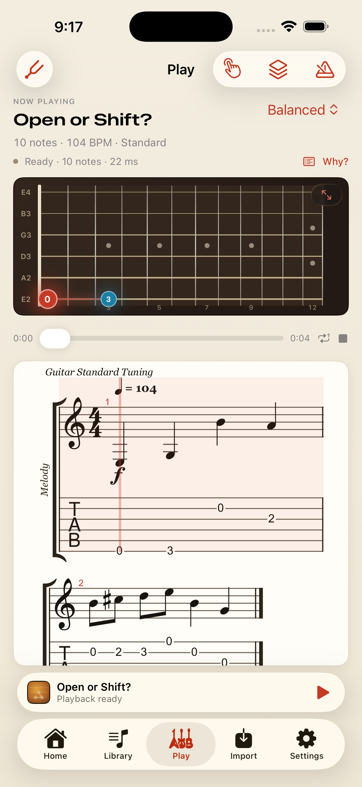

> **Tutorial Mode:** Learn now contains a 12-lesson original beginner course and the 18 existing Free Practice exercises. Tutorial microphone pitch checking is an internal Debug experiment, disabled by default. App Store finalization has resumed; signing and physical-device gates are tracked in `docs/release/finalization.md`. See `docs/tutorial-mode.md` for course architecture.

> **First App Store release:** 12 original beginner lessons and 18 original single-note guitar exercises, with offline notation, tab, playback and synchronized fretboard positions. Scanning and public file import are not shipped. Scanner UI/networking are compiled only in Debug and default off. See `RELEASE_CHECKLIST.md`; older recognition sections below describe retained development work, not public release features.

# StringMap

StringMap is a native iPhone/iPad app for turning structured scores into playable, explainable guitar tablature. The native implementation has this score pipeline. Photo recognition is under validation and is not release-ready:

```text
Photo → HOMR service → reviewed MusicXML
                           ↓
MusicXML → normalized score → all string/fret candidates
         → explainable fingering optimization → alphaTex
         → alphaTab notation, tablature, and synchronized playback
```

The native MusicXML importer supports single-part guitar melodies, stacked-note chords, independent voices, rests, ties, simple repeats, and supported binary, dotted, and 3:2 triplet rhythms. Unsupported musical structures fail explicitly; unimplemented expression and text instructions are disclosed for review. The guitar layer supports Standard, Drop D, Half Step Down, D Standard, DADGAD, and custom six-string tunings; capo, 12–30 fret instruments, transposition, manual locks, and five optimization profiles are real inputs to candidate generation and search.

| Dark | Light |
| --- | --- |
|  |  |

## Native iOS experience

The SwiftUI app is not a wrapped website. Native tabs provide Home, Library, Play, Import, and Settings, with the transport docked in the iOS 26 tab-view bottom accessory so playback stays reachable from every tab. SwiftData stores imported MusicXML, instrument/profile choices, locked positions, arrangement state, and the last practice position locally.

The interface is an aged-nitro cream chassis in light and a warm tobacco one in dark, both authored deliberately rather than one derived from the other. The instrument is the inversion that carries the design: wherever the app shows the guitar itself the surface goes dark — rosewood board, nickel fret wire, a bone nut, bronze strings — mounted into the chassis the way an amplifier is built. One accent runs the interface, fiesta red; lake blue and surf green never touch a control and carry meaning inside data only. The palette, spacing scale, nested surfaces, and motion live in [`DesignSystem.swift`](./apps/ios/StringMap/DesignSystem.swift). alphaTab is themed to match, so the score is engraved in the app's own ink instead of sitting in the layout as a white rectangle.

The fretboard is the app's hero: a luminous route running across the neck from the note sounding now to the one coming next, over logarithmically spaced frets, graded string gauges, and inlay markers. Scores are told apart the way guitars are, by finish — sunburst, lake placid, surf green, cherry — rather than by rotating one gradient around the colour wheel.

The workspace includes:

- standard notation and tablature rendered by the isolated alphaTab view
- synchronized local SoundFont playback and scrub/seek
- a native SwiftUI fretboard following current and upcoming notes
- Beginner, Balanced, Stay in Position, Minimum Movement, and Performance profiles
- measurable Beginner/Balanced/Minimum Movement arrangement comparisons
- tuning, custom tuning, capo suggestion, fret count, and ±24-semitone transposition
- tempo presets, A/B measure looping, count-in, and metronome
- previous/next measure, five-second jump-back, one-tap current-measure loop, loop restart, and tempo reset
- note-by-note alternate position selection and locked-fingering reoptimization
- per-song practice speed, loop, timing options, fingering locks, and resume position
- a complete weighted cost trace plus best-route comparisons for every rejected candidate, presented as a per-note cost bar that names the force which actually decided the position

Photo import includes Camera/Photos, crop/rotation/perspective preparation, an explicit upload, resumable cancellation-aware recognition, source-image comparison, note/rest/chord correction, undo, audition, and local saving. Debug-only service configuration is compiled out of Release builds. Recognition accuracy and manual/device validation remain release blockers.

New photos default to standard guitar notation: written pitches sound one octave lower. The preparation screen also offers concert pitch. This is an explicit input convention, independent of guitar range and optimization; existing MusicXML transposition wins, corrected saves reopen without another shift, and earlier drafts retain their previous interpretation. Review note names and octaves are labeled as sounding pitch.

## Workspace

- `apps/ios` — the native SwiftUI/Xcode application and shipping implementation.
- `apps/ios/Packages/StringMapCore` — independent Swift products for `FingeringEngine` and `ScorePipeline`.
- `packages/fingering-engine` and `packages/score-pipeline` — TypeScript behavioral references.
- `apps/web` — the retained Vite reference application.

The score model sits between ingestion and fingering. The OMR adapter returns MusicXML into that same boundary; it does not change the optimizer or renderer.

- `services/omr` — the pinned `HOMR` guitar adapter, authenticated production service candidate, container configuration and actual-recognizer benchmark.

## Run the iOS app

Requires Xcode 26, the iOS 26 simulator runtime, and [XcodeGen](https://github.com/yonaskolb/XcodeGen).

```bash
cd apps/ios/Packages/StringMapCore
swift test

cd ../..
xcodegen generate
open StringMap.xcodeproj
```

The generated project targets iPhone and iPad with bundle ID `com.anishtalla.StringMap`. It launches with a known melody, so notation, tablature, the fingering trace, and playback can be checked immediately. See [the iOS README](./apps/ios/README.md) for command-line simulator verification.

## Run the web reference

Requires Node.js 20 or newer.

```bash
npm install
npm test
npm run typecheck
npm run dev
```

Open the Vite URL and choose a `.musicxml` or `.xml` file. The included known melody loads by default. The Swift implementation is the source of truth; this app is retained for regression comparison and does not mirror every native feature.

Production verification:

```bash
npm run build
```

## Included demo scores

Five repository-owned MusicXML studies make the app demonstrable without downloading copyrighted music:

- **Known Melody** — the immediate launch and playback check
- **First Position Scale** — a slow beginner C-major scale
- **Open or Shift?** — a passage where profile tradeoffs become visible
- **Low D Resonance** — a melody whose low D requires Drop D tuning
- **Chromatic Position Study** — fast chromatic motion and large intervals

The four library-ready studies appear under Import → Included Studies. Their composer metadata identifies them as original StringMap studies.

## Current MusicXML contract

The Swift parser accepts plain MusicXML (`.musicxml`/`.xml`) and compressed MusicXML (`.mxl`), with one part on one staff, and preserves source event IDs, voices, title/composer, sounding pitch, measure-local onset, duration, rests, time signatures, key changes, constant tempo, ties, and simple repeats. Instrument transpose is applied once; clef octave notation does not apply a second transposition. Canonical corrected MusicXML preserves identities through editing and reimport. Compressed imports use the container's first declared score, bounded decompression and CRC validation; embedded images/audio and alternate renditions are ignored. The original extracted XML is saved locally.

Stacked notes are assigned jointly to distinct strings, including strings occupied by sustained voices. Locks, tuning, capo, a conservative fret-span/finger constraint, and deterministic complete-route costs govern the result. Unplayable tab leaves the recognized notation available for correction and playback; notes are never dropped or shifted an octave to fit the guitar.

Multiple parts/staves, piano scores, chord names, grace notes, unsupported tuplets/articulations/techniques, complex repeat instructions and tempo changes are rejected. The actual bundled alphaTab parser and MIDI generator verify the supported rhythm boundary. The TypeScript reference retains its earlier monophonic contract. See [architecture](docs/ARCHITECTURE.md).

## Fingering optimization

For every MIDI note, the engine enumerates every string whose open pitch can reach the note within the fret limit. These candidate sets become layers in a directed acyclic graph. Dynamic programming finds the exact minimum-cost path across the layers in `O(notes × candidates²)` time; a six-string instrument has at most six candidates per layer.

For candidate path `p₁ … pₙ`, the objective is:

```text
C(p₁ … pₙ) = Σᵢ U(pᵢ) + Σᵢ₌₂ⁿ T(pᵢ₋₁, pᵢ)

DP(i, p) = U(p) + min_q [DP(i − 1, q) + T(q, p)]
```

`U` contains fret-height, open-string, and preferred-initial-position terms. `T` contains fret movement, hand-position shift, string change/skip, large-stretch, repeated-note, and awkward-jump terms. Ties and user locks remove invalid graph edges or candidates before the recurrence. Strict ordering provides deterministic tie-breaking.

Every result includes:

- chosen string and fret
- number of valid candidates
- each weighted unary and transition cost
- incremental and cumulative costs
- the exact profile weights
- whether a choice is user-locked
- measured shifts, string changes/skips, open strings, average fret, largest jump, and normalized difficulty
- every alternate candidate's best complete route cost, predecessor, and rejection reason

Costs include physical fret movement, hand-position shifts, string changes and skips, large stretches, high-fret difficulty, open-string preference, repeated-note consistency, preferred initial position, and extremely awkward jumps. Locked positions restrict a candidate layer to the user's valid choice; the same exact dynamic program then optimizes the surrounding passage.

## Current limitations

- Recognition has failed the initial accuracy benchmark. Handwriting, real camera-image accuracy, and correction-to-reference have not been established.
- The prepared 102-image corpus consists of 20 original synthetic studies with five variants each and two negative images. It does not satisfy the required genuine handwriting, camera, and independently reviewed reference coverage.
- Single-page JPEG/PNG/HEIF photo selection is supported in the app; the upload is normalized JPEG. PDF and multi-page photo recognition, MIDI, piano scores and chord-name interpretation are excluded. Structured MusicXML imports can span multiple pages.
- The hosted recognition service is prepared but has not been deployed. Debug builds can use a loopback service; Release builds require a configured HTTPS endpoint and Apple signing.
- Native correction, image preparation and local persistence are implemented. Complete manual and physical-device verification remains open.
- Saved music remains offline. Scanning requires internet. No customer accounts, analytics, payments, microphone recording or social features are included.

See [recognition service setup](services/omr/README.md) and [release evidence](docs/release/evidence.md).

## Release status

**Not ready for App Store submission.** Current test results, recognition comparisons, retained artifacts and external prerequisites are recorded in [release evidence](docs/release/evidence.md). A signed Release archive and seven-day TestFlight exercise have not been completed.

- [Release checklist](RELEASE_CHECKLIST.md)
- [Draft listing and review instructions](docs/store/metadata.md)
- [Device and TestFlight protocol](docs/release/device-testflight.md)
- [Measured hosting proposal](docs/release/hosting-costs.md)
- [Published privacy](https://anishtalla27.github.io/StringMap/privacy.html), [support](https://anishtalla27.github.io/StringMap/support.html), and [licenses](https://anishtalla27.github.io/StringMap/licenses.html)

Existing screenshots are historical design references; fresh verified shipping screenshots remain a release gate.

## References and licensing

alphaTab is used as the notation/tab renderer and synchronized player. HOMR powers the separate AGPL-licensed recognition service with a downloadable corresponding-source offer. The native app bundles a CC0 FreePats guitar bank. MoChord informed the high-level separation between per-shape and transition scoring; StringMap's monophonic graph, cost components, profiles, types, and implementation were written for this repository. Partitura was evaluated but is not included in the iOS runtime. Tably was inspected only; no Tably code was copied because its repository has no license.

See [THIRD_PARTY_NOTICES.md](./THIRD_PARTY_NOTICES.md) for details.
